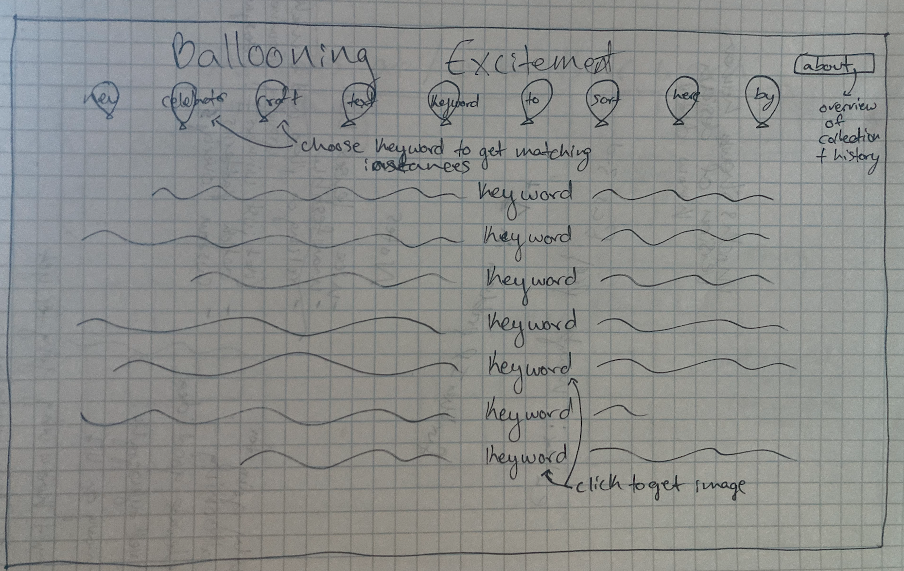

Sketches for Qualitative Project
Daia Bromberg 10/3/24

The balloon project sketch includes lines of text with a keyword included displayed with the keyword lined up and in a color for emphasis. The text is sorted from keyword options at the top that are each in a little balloon drawing graphic. This text is pulled from the descriptions of items in the Smithsonian collection "The NASM Collection of Objects Related to Early Ballooning" with 451 total objects. Clicking on one of the displayed lines will display the item and it's description.

The artists with their work project sketch is somewhere between a treemap and a venn diagram. It shows which categories of action the photographs of artists working on or with their work fall under. The individual photographs will be displayed in small scale within the overlapping boxes that apply to them based on the verbs found within their descriptions. Clicking on a single box makes it larger and displays the description and title. My preliminary exploration yielded 1613 entires to work with in this dataset. Likely there will be less as the description field is not consistently fruitful. 
