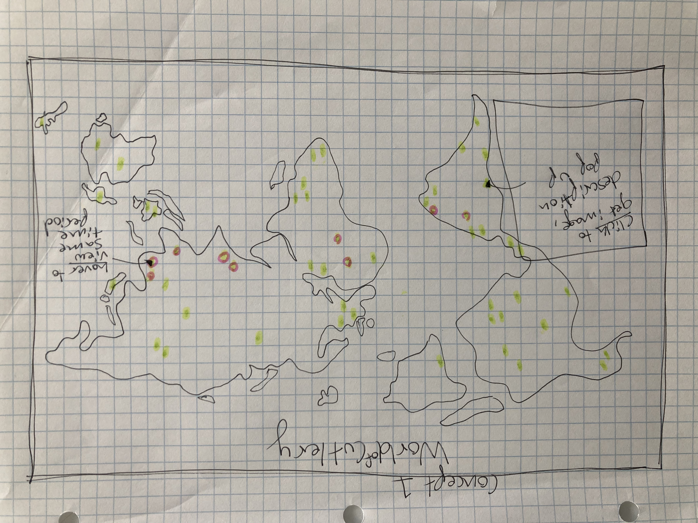
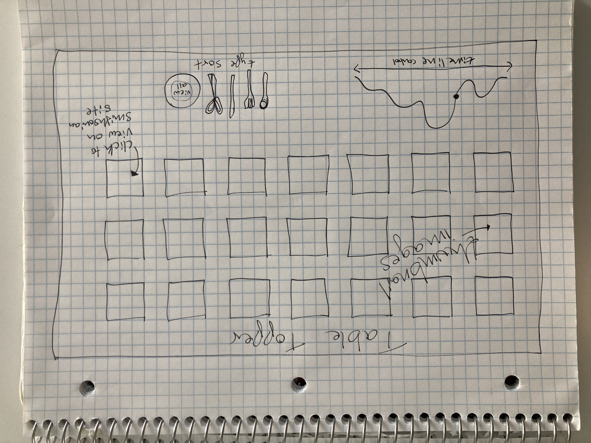

Project 3

Cutlery Chronicles

Cutlery Chronicles explores cutlery within the Smithsonian collections with items from both the Cooper Hewitt Design Museum and the National Museum of American History. It includes two views- a photo gallery of the individual items with descriptions, and a timeline chart view with filters for different materials and types. 

Pages: https://daiarose.github.io/major-studio-1-daia/Project03/

Mocks: 

Prototype:

Sketch ideas:

World of Cutlery displays the geographic scope of all cutlery within the Smithsonian collections. It has dots on locations for the objects origins and highlights objects from the same time period on hover. You can also click to view an image and description of the object. I think interactivity is necessary in this project in order to zoom in on relevant map areas, highlight similar pieces, and allow the user to explore the depth of information that a map of all the items can display. I would use a similar cutlery dataset to explore this visualization as I did for Project 1 with new parameters to fit the geographic exploration. 

Table Topper displays the sortable thumbnail images of all cutlery within the Smithsonian collections. It has two navigation icons to scroll by timeline and view by type. You can also click to view the Smithsonian site with more images and details about the object. I think interactivity is necessary in this project because there is so much for the viewer to explore and I want the timeline to allow dynamic control of the thumbnail stream. I would use a similar cutlery dataset to explore this visualization as I did for Project 1 with new parameters to fit the timeline exploration. 

Cutlery Chronicle displays all cutlery within the Smithsonian collections as animated transition dot plots. It has squares colored by museum and buttons to sort by year, dimensions, or place. You can also hover to view the details of the object with a link to the Smithsonian site as well. I think interactivity is necessary in this project because I want to chart itself to be malleable to user chosen parameter and the smooth transition between these displays will convey that it is the same set of objects. I would use a similar cutlery dataset to explore this visualization as I did for Project 1 with new parameters for dimension, place, and museum source. 
